# MerkSeal

A **secure, cryptographically-verifiable file sharing system** built with Rust that leverages Merkle trees to ensure file integrity and authenticity. This project enables clients to upload files to a server, delete local copies, and later retrieve files with cryptographic proof that they haven't been tampered with.

## 🎯 Project Overview

This system solves a critical problem in distributed file storage: **How can you trust that a file retrieved from a remote server is exactly the same as the file you originally uploaded?**

The solution uses **Merkle trees** - a fundamental cryptographic data structure that creates a unique fingerprint (root hash) representing all uploaded files. This fingerprint can be used to verify any individual file without needing to download all files.

## 🔑 Key Features

- **Cryptographic File Integrity**: Uses Merkle tree proofs to verify file authenticity
- **Space Efficient**: Delete local copies after upload while maintaining verification capability
- **Tamper Detection**: Instantly detects any modifications to files during transit or storage
- **Minimal Storage**: Only requires storing a single root hash (32 bytes) to verify unlimited files
- **Client-Server Architecture**: Clean separation between storage and verification concerns
- **Mantle L2 Integration**: On-chain anchoring for immutable proof

## 🔗 Quick Links

- **[Developer SDK](sdk/)** - npm package for easy integration ⭐⭐⭐
- **[E2E Testing](E2E_TESTING.md)** - End-to-end test guide ⭐
- **[Demo Walkthrough](DEMO.md)** - Step-by-step guide for judges
- **[Mantle Architecture](MANTLE_ARCHITECTURE.md)** - Why modular DA makes this possible ⭐
- **[Gas Benchmarks](BENCHMARKS.md)** - 200-500x cheaper than other L2s ⭐
- **[Video Demo Script](VIDEO_DEMO.md)** - 3-minute demo guide
- **[Legal Example](examples/legal-notarization/)** - Real-world RWA use case
- **[Ecosystem Integration](ECOSYSTEM.md)** - Partner opportunities ⭐
- **[The Graph Subgraph](subgraph/)** - Query batch data
- **[Configuration Guide](CONFIG.md)** - Mantle setup
- **[Deployment Guide](contracts/DEPLOYMENT.md)** - Contract deployment

## 🛠️ For Developers

**Integrate MerkSeal in 5 lines of code:**

```typescript
import { MerkSeal } from '@MerkSeal/sdk';

const drive = new MerkSeal({...});
const batch = await drive.uploadAndAnchor(['file1.pdf', 'file2.pdf']);
console.log('Anchored on Mantle:', batch.mantleBatchId);
```

**See [SDK Documentation](sdk/README.md) for full API reference.**

## 🏗️ Architecture

The project is organized as a Rust workspace with three main components:

```
merkle-file-share/
├── merkle_tree/     # Core Merkle tree implementation
├── client/          # Client application for file upload/download
├── server/          # Server for file storage and proof generation
└── README.md
```

### Components

#### 1. **Merkle Tree Library** (`merkle_tree/`)
Core cryptographic implementation providing:
- Merkle tree construction from file hashes
- Root hash computation
- Merkle proof generation
- Proof verification

#### 2. **Client** (`client/`)
Command-line application that:
- Uploads files to the server
- Computes and stores the Merkle root hash
- Requests files with Merkle proofs
- Verifies downloaded files against the stored root hash
- Built with `tokio` for async operations and `reqwest` for HTTP communication

#### 3. **Server** (`server/`)
HTTP server that:
- Stores uploaded files
- Generates Merkle proofs for requested files
- Serves files with their corresponding proofs
- Built with `actix-web` for high-performance HTTP serving

## 🔐 How It Works

### Upload & Verification Flow

```mermaid
sequenceDiagram
    participant Client
    participant Server
    participant LocalStorage
    
    Note over Client: Phase 1: Upload
    Client->>Client: Hash each file (F1, F2, ..., Fn)
    Client->>Client: Build Merkle tree from hashes
    Client->>Client: Store root hash locally
    Client->>Server: Upload all files
    Client->>LocalStorage: Delete local file copies
    
    Note over Client: Phase 2: Download & Verify
    Client->>Server: Request file Fi + proof Pi
    Server->>Server: Generate Merkle proof for Fi
    Server->>Client: Send Fi + Pi
    Client->>Client: Hash received file
    Client->>Client: Compute root from hash + proof
    Client->>Client: Compare computed root with stored root
    alt Roots match
        Client->>Client: ✓ File verified - safe to use
    else Roots differ
        Client->>Client: ✗ File rejected - tampering detected
    end
```



### Merkle Tree Verification

1. **Upload Phase**:
   - Client hashes each file using a cryptographic hash function (e.g., SHA-256)
   - Builds a Merkle tree from these hashes
   - Computes the root hash of the tree
   - Stores ONLY the root hash locally (~32 bytes)
   - Uploads files to server
   - Deletes local copies to save space

2. **Download & Verification Phase**:
   - Client requests the i-th file (Fi) from server
   - Server sends Fi along with a Merkle proof (Pi)
   - Client hashes the received file
   - Uses the proof to compute what the root hash should be
   - Compares computed root with stored root
   - **If they match**: File is authentic and unmodified ✓
   - **If they differ**: File has been corrupted or tampered with ✗

## 🚀 Getting Started

### Prerequisites

- Rust 1.70+ (with Cargo)
- Basic understanding of cryptographic hash functions

### Installation

```bash
# Clone the repository
git clone <repository-url>
cd merkle-file-share

# Build all components
cargo build --release
```

### Running the Server

```bash
cd server
cargo run --release
```

The server will start on `http://localhost:8080` (default).

### Running the Client

```bash
cd client
cargo run --release
```

## 📚 Technical Details

### Cryptographic Properties

- **Deterministic**: Same files always produce the same root hash
- **Efficient**: Proof size is O(log n) where n is the number of files
- **Secure**: SHA-256 provides 128-bit collision resistance
- **Complete**: Any modification to any file changes the root hash

### API Endpoints (Planned)

- `POST /upload` - Upload files to server
- `GET /file/:index` - Download file with Merkle proof
- `GET /health` - Server health check

---

## 🔗 Mantle L2 Integration

**MerkSeal is now a Mantle-native infrastructure tool!** Merkle roots are anchored on Mantle L2 for immutable, on-chain verification.

### Why Mantle?

- **Low-cost anchoring**: Mantle's L2 fees make on-chain storage practical
- **EVM compatibility**: Easy integration with existing tools
- **Immutability**: On-chain roots provide tamper-proof audit trails
- **Infrastructure track**: Perfect fit for verifiable storage infrastructure

### Architecture

```
┌──────────────┐
│    Client    │
└──────┬───────┘
       │ 1. Upload files
       ▼
┌──────────────┐
│    Server    │──► Computes Merkle root
└──────┬───────┘
       │ 2. Returns BatchMetadata
       │    (root, file_count, registry_address)
       ▼
┌──────────────┐
│Anchor Script │──► Calls registerBatch(root, metaURI)
└──────┬───────┘
       │ 3. Anchors on Mantle
       ▼
┌──────────────────────────┐
│ Mantle L2 (Testnet/Main) │
│  MerkleBatchRegistry     │──► Stores root on-chain
└──────┬───────────────────┘
       │ 4. Returns mantle_batch_id
       ▼
┌──────────────┐
│    Client    │──► Verifies files against on-chain root
└──────────────┘
```

### Quick Start

#### 1. Deploy Registry Contract

```bash
cd contracts
forge create --rpc-url https://rpc.testnet.mantle.xyz \
  --private-key $PRIVATE_KEY \
  MerkleBatchRegistry
```

Save the deployed address to `.env`:
```bash
MERKLE_BATCH_REGISTRY_ADDRESS=0xYourDeployedAddress
```

#### 2. Start Server

```bash
cargo run -p server
```

#### 3. Upload Files

```bash
curl -X POST http://localhost:8080/upload \
  -F "file1=@doc.pdf" \
  -F "file2=@image.jpg" \
  > response.json
```

Response includes Merkle root and registry address.

#### 4. Anchor on Mantle

```bash
cd scripts
npm install
node anchor.js $(jq -r '.batch.root' ../response.json) \
              $(jq -r '.batch.suggested_meta_uri' ../response.json)
```

Returns `mantle_batch_id` and transaction hash.

#### 5. Verify Against Mantle

```bash
cargo run -p client -- verify --batch-id 1 --mantle-batch-id 1
```

Output shows:
- ✅ Local files match local root
- ✅ Local root matches on-chain root
- ✅ Batch is verified and tamper-proof

### Components

| Component | Purpose | Tech Stack |
|-----------|---------|------------|
| **MerkleBatchRegistry.sol** | On-chain root storage | Solidity 0.8.20 |
| **anchor.js** | Anchor roots on Mantle | TypeScript + ethers.js |
| **client verify** | Verify against Mantle | Rust + ethers |
| **server** | Compute & return roots | Rust + actix-web |

### Hackathon Highlights

**Infrastructure & Tooling Track**:
- ✅ Verifiable off-chain storage layer
- ✅ Minimal, auditable smart contract (<100 lines)
- ✅ Gas-efficient design (L2 = ~$0.0001 per batch)
- ✅ Event-driven architecture for easy indexing

**RWA/RealFi Narrative**:
- Merkle roots = cryptographic fingerprints of real-world documents
- On-chain anchoring = tamper-proof audit trail
- Use cases: Legal docs, supply chain, medical records

**Mantle-Native Design**:
- Built specifically for Mantle's low-fee environment
- Leverages EVM compatibility
- Testnet-ready with faucet integration

See [DEMO.md](DEMO.md) for complete walkthrough.

---

## 📚 Technical Details

**Current Status**: ✅ **Hackathon Ready - Mantle L2 Integration Complete**

- [x] Project structure created
- [x] Workspace configuration
- [x] Dependencies configured
- [x] Merkle tree implementation (SHA-256)
- [x] Client CLI with verification
- [x] Server storage implementation
- [x] Mantle L2 smart contract
- [x] On-chain root anchoring
- [x] Anchor script (TypeScript)
- [x] Three-level verification (files → local root → on-chain root)
- [x] CLI interface (clap)
- [x] Comprehensive documentation
- [x] Demo walkthrough for judges

**What's Working**:
- ✅ Upload files to server → compute Merkle root
- ✅ Anchor root on Mantle testnet → get batch ID
- ✅ Verify files against on-chain root → cryptographic proof
- ✅ Tamper detection → modified files are caught

**Tech Stack**:
- **Smart Contract**: Solidity 0.8.20 (Foundry)
- **Backend**: Rust (actix-web, tokio)
- **Cryptography**: SHA-256 Merkle trees
- **Blockchain**: Mantle L2 (testnet ready)
- **Tooling**: ethers.js, clap

**Gas Costs** (Mantle Testnet):
- Register batch: ~82,000 gas (~$0.0001)
- Query batch: Free (view function)

## 🤝 Contributing

Contributions are welcome! This project is in early stages and there's plenty of work to do:

1. Fork the repository
2. Create a feature branch (`git checkout -b feature/amazing-feature`)
3. Commit your changes (`git commit -m 'Add amazing feature'`)
4. Push to the branch (`git push origin feature/amazing-feature`)
5. Open a Pull Request

## 📖 Use Cases

- **Cloud Storage Verification**: Verify files downloaded from cloud storage
- **Backup Systems**: Ensure backup integrity without downloading entire backups
- **Distributed Systems**: Verify data integrity in distributed file systems
- **Archival Systems**: Long-term storage with verification guarantees
- **Content Distribution**: CDNs can prove content authenticity

## 📝 License

This project is open source and available under the MIT License.

## 🔗 References

- [Merkle Trees - Wikipedia](https://en.wikipedia.org/wiki/Merkle_tree)
- [Cryptographic Hash Functions](https://en.wikipedia.org/wiki/Cryptographic_hash_function)
- [Rust Documentation](https://www.rust-lang.org/)

## 📧 Contact

For questions or suggestions, please open an issue on GitHub.

---

**Built with ❤️ using Rust**