# MerkleDriv

A **secure, cryptographically-verifiable file sharing system** built with Rust that leverages Merkle trees to ensure file integrity and authenticity. This project enables clients to upload files to a server, delete local copies, and later retrieve files with cryptographic proof that they haven't been tampered with.

## 🎯 Project Overview

This system solves a critical problem in distributed file storage: **How can you trust that a file retrieved from a remote server is exactly the same as the file you originally uploaded?**

The solution uses **Merkle trees** - a fundamental cryptographic data structure that creates a unique fingerprint (root hash) representing all uploaded files. This fingerprint can be used to verify any individual file without needing to download all files.

## 🔑 Key Features

- **Cryptographic File Integrity**: Uses Merkle tree proofs to verify file authenticity
- **Space Efficient**: Delete local copies after upload while maintaining verification capability
- **Tamper Detection**: Instantly detects any modifications to files during transit or storage
- **Minimal Storage**: Only requires storing a single root hash (32 bytes) to verify unlimited files
- **Client-Server Architecture**: Clean separation between storage and verification concerns

## 🏗️ Architecture

The project is organized as a Rust workspace with three main components:

```
merkle-file-share/
├── merkle_tree/     # Core Merkle tree implementation
├── client/          # Client application for file upload/download
├── server/          # Server for file storage and proof generation
└── README.md
```

### Components

#### 1. **Merkle Tree Library** (`merkle_tree/`)
Core cryptographic implementation providing:
- Merkle tree construction from file hashes
- Root hash computation
- Merkle proof generation
- Proof verification

#### 2. **Client** (`client/`)
Command-line application that:
- Uploads files to the server
- Computes and stores the Merkle root hash
- Requests files with Merkle proofs
- Verifies downloaded files against the stored root hash
- Built with `tokio` for async operations and `reqwest` for HTTP communication

#### 3. **Server** (`server/`)
HTTP server that:
- Stores uploaded files
- Generates Merkle proofs for requested files
- Serves files with their corresponding proofs
- Built with `actix-web` for high-performance HTTP serving

## 🔐 How It Works

### Upload & Verification Flow

```mermaid
sequenceDiagram
    participant Client
    participant Server
    participant LocalStorage
    
    Note over Client: Phase 1: Upload
    Client->>Client: Hash each file (F1, F2, ..., Fn)
    Client->>Client: Build Merkle tree from hashes
    Client->>Client: Store root hash locally
    Client->>Server: Upload all files
    Client->>LocalStorage: Delete local file copies
    
    Note over Client: Phase 2: Download & Verify
    Client->>Server: Request file Fi + proof Pi
    Server->>Server: Generate Merkle proof for Fi
    Server->>Client: Send Fi + Pi
    Client->>Client: Hash received file
    Client->>Client: Compute root from hash + proof
    Client->>Client: Compare computed root with stored root
    alt Roots match
        Client->>Client: ✓ File verified - safe to use
    else Roots differ
        Client->>Client: ✗ File rejected - tampering detected
    end
```



### Merkle Tree Verification

1. **Upload Phase**:
   - Client hashes each file using a cryptographic hash function (e.g., SHA-256)
   - Builds a Merkle tree from these hashes
   - Computes the root hash of the tree
   - Stores ONLY the root hash locally (~32 bytes)
   - Uploads files to server
   - Deletes local copies to save space

2. **Download & Verification Phase**:
   - Client requests the i-th file (Fi) from server
   - Server sends Fi along with a Merkle proof (Pi)
   - Client hashes the received file
   - Uses the proof to compute what the root hash should be
   - Compares computed root with stored root
   - **If they match**: File is authentic and unmodified ✓
   - **If they differ**: File has been corrupted or tampered with ✗

## 🚀 Getting Started

### Prerequisites

- Rust 1.70+ (with Cargo)
- Basic understanding of cryptographic hash functions

### Installation

```bash
# Clone the repository
git clone <repository-url>
cd merkle-file-share

# Build all components
cargo build --release
```

### Running the Server

```bash
cd server
cargo run --release
```

The server will start on `http://localhost:8080` (default).

### Running the Client

```bash
cd client
cargo run --release
```

## 📚 Technical Details

### Cryptographic Properties

- **Deterministic**: Same files always produce the same root hash
- **Efficient**: Proof size is O(log n) where n is the number of files
- **Secure**: SHA-256 provides 128-bit collision resistance
- **Complete**: Any modification to any file changes the root hash

### API Endpoints (Planned)

- `POST /upload` - Upload files to server
- `GET /file/:index` - Download file with Merkle proof
- `GET /health` - Server health check

## 🛠️ Development Status

**Current Status**: 🚧 Early Development

- [x] Project structure created
- [x] Workspace configuration
- [x] Dependencies configured
- [ ] Merkle tree implementation
- [ ] Client upload functionality
- [ ] Server storage implementation
- [ ] Proof generation
- [ ] Proof verification
- [ ] CLI interface
- [ ] Integration tests
- [ ] Documentation

## 🤝 Contributing

Contributions are welcome! This project is in early stages and there's plenty of work to do:

1. Fork the repository
2. Create a feature branch (`git checkout -b feature/amazing-feature`)
3. Commit your changes (`git commit -m 'Add amazing feature'`)
4. Push to the branch (`git push origin feature/amazing-feature`)
5. Open a Pull Request

## 📖 Use Cases

- **Cloud Storage Verification**: Verify files downloaded from cloud storage
- **Backup Systems**: Ensure backup integrity without downloading entire backups
- **Distributed Systems**: Verify data integrity in distributed file systems
- **Archival Systems**: Long-term storage with verification guarantees
- **Content Distribution**: CDNs can prove content authenticity

## 📝 License

This project is open source and available under the MIT License.

## 🔗 References

- [Merkle Trees - Wikipedia](https://en.wikipedia.org/wiki/Merkle_tree)
- [Cryptographic Hash Functions](https://en.wikipedia.org/wiki/Cryptographic_hash_function)
- [Rust Documentation](https://www.rust-lang.org/)

## 📧 Contact

For questions or suggestions, please open an issue on GitHub.

---

**Built with ❤️ using Rust**