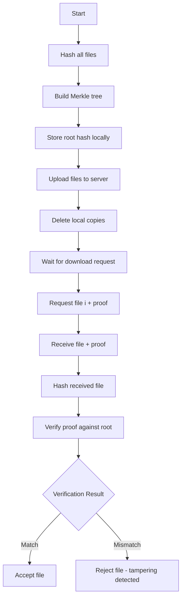

# Technical Report: Merkle File Share System

**Project**: Merkle File Share  
**Language**: Rust  
**Architecture**: Client-Server with Cryptographic Verification  
**Status**: Early Development Phase  
**Date**: December 2024

---

## Executive Summary

The Merkle File Share system is a cryptographically-secure file sharing solution that enables clients to upload files to a remote server, delete local copies to save space, and later download files with mathematical proof of their authenticity and integrity. The system leverages **Merkle trees**, a fundamental data structure in cryptography, to provide O(log n) verification with O(1) storage requirements on the client side.

---

## 1. Problem Statement

### 1.1 Core Challenge

In distributed file storage systems, a fundamental trust problem exists:

> **How can a client verify that a file retrieved from a remote server is identical to the file originally uploaded, especially when the client has deleted its local copy?**

### 1.2 Requirements

1. **Space Efficiency**: Client must delete local files after upload to save disk space
2. **Strong Verification**: Client must detect any file modifications (corruption, tampering, or transmission errors)
3. **Minimal Storage**: Client should store minimal data for verification purposes
4. **Selective Retrieval**: Client should verify individual files without downloading all files
5. **Performance**: Verification should be computationally efficient

### 1.3 Threat Model

The system protects against:
- **Malicious Server**: Server intentionally modifies files
- **Storage Corruption**: Hardware failures causing bit flips
- **Network Tampering**: Man-in-the-middle attacks during transmission
- **Unintended Modifications**: Software bugs causing data corruption

---

## 2. Solution Architecture

### 2.1 Merkle Tree Overview

A **Merkle tree** (also called a hash tree) is a binary tree where:
- **Leaf nodes** contain hashes of data blocks (files)
- **Internal nodes** contain hashes of their children
- **Root node** contains a hash representing the entire tree

```
                    Root Hash (R)
                   /              \
                H(AB)             H(CD)
               /    \            /    \
            H(A)   H(B)       H(C)   H(D)
             |      |          |      |
           File1  File2     File3  File4
```

**Key Property**: Any change to any file changes the root hash.

### 2.2 Mathematical Foundation

Given files F₁, F₂, ..., Fₙ:

1. **Leaf hashes**: hᵢ = H(Fᵢ) for i = 1 to n
2. **Parent hashes**: H(parent) = H(H(left_child) || H(right_child))
3. **Root hash**: R = root of the Merkle tree

**Verification**: For file Fᵢ, the Merkle proof Pᵢ consists of sibling hashes along the path from leaf to root. The client can compute:

```
R' = ComputeRoot(H(Fᵢ), Pᵢ)
```

If R' == R (stored root), then Fᵢ is verified.

### 2.3 System Components

#### Component 1: Merkle Tree Library

**Location**: `merkle_tree/`  
**Purpose**: Core cryptographic implementation  
**Responsibilities**:

- Hash computation using SHA-256 or similar
- Merkle tree construction from file hashes
- Root hash calculation
- Merkle proof generation for arbitrary leaf indices
- Merkle proof verification

**Key Algorithms**:

```rust
// Pseudocode for key functions
pub struct MerkleTree {
    nodes: Vec<Hash>,
    leaf_count: usize,
}

impl MerkleTree {
    // Build tree from file hashes
    pub fn new(file_hashes: Vec<Hash>) -> Self;
    
    // Get the root hash
    pub fn root(&self) -> Hash;
    
    // Generate proof for i-th file
    pub fn generate_proof(&self, index: usize) -> MerkleProof;
    
    // Verify a proof
    pub fn verify_proof(
        file_hash: Hash,
        proof: MerkleProof,
        root: Hash
    ) -> bool;
}
```

#### Component 2: Client Application

**Location**: `client/`  
**Technology Stack**:
- `tokio`: Async runtime for concurrent operations
- `reqwest`: HTTP client for server communication
- `serde`/`serde_json`: Serialization/deserialization

**Workflow**:



**Storage Requirements**:
- Root hash: 32 bytes (SHA-256)
- File index mapping: Minimal overhead
- **Total**: ~32 bytes regardless of number of files

#### Component 3: Server Application

**Location**: `server/`  
**Technology Stack**:
- `actix-web`: High-performance async HTTP server
- `serde`/`serde_json`: Data serialization

**Responsibilities**:
- Store uploaded files
- Maintain file index
- Rebuild Merkle tree from stored files
- Generate Merkle proofs on demand
- Serve files with accompanying proofs

**API Design** (Planned):

```
POST /upload
Request: multipart/form-data with files
Response: { "success": true, "file_count": n }

GET /file/:index
Response: {
    "file_data": base64_encoded_file,
    "proof": {
        "siblings": [hash1, hash2, ...],
        "path_bits": [0, 1, 0, ...]
    }
}
```

---

## 3. Cryptographic Analysis

### 3.1 Security Properties

#### Collision Resistance
- **Property**: Computationally infeasible to find F₁ ≠ F₂ where H(F₁) = H(F₂)
- **Guarantee**: Using SHA-256 provides ~128-bit collision resistance
- **Implication**: Attacker cannot substitute a different file with same hash

#### Preimage Resistance
- **Property**: Given hash h, computationally infeasible to find F where H(F) = h
- **Guarantee**: SHA-256 provides 256-bit preimage resistance
- **Implication**: Attacker cannot reverse-engineer file from its hash

#### Second Preimage Resistance
- **Property**: Given F₁, computationally infeasible to find F₂ ≠ F₁ where H(F₁) = H(F₂)
- **Guarantee**: SHA-256 provides ~256-bit second preimage resistance
- **Implication**: Attacker cannot find alternative file matching stored hash

### 3.2 Verification Complexity

| Operation | Time Complexity | Space Complexity |
|-----------|----------------|------------------|
| Tree Construction | O(n) | O(n) |
| Root Computation | O(n) | O(n) |
| Proof Generation | O(log n) | O(log n) |
| Proof Verification | O(log n) | O(1) |
| Client Storage | O(1) | O(1) |

Where n = number of files.

**Example**: For 1 million files:
- Proof size: ~20 hashes × 32 bytes = 640 bytes
- Verification time: ~20 hash operations
- Client storage: 32 bytes (root hash only)

### 3.3 Attack Scenarios

#### Scenario 1: Modified File Attack
**Attack**: Server sends modified file F'ᵢ instead of Fᵢ  
**Detection**: H(F'ᵢ) ≠ H(Fᵢ), proof verification fails  
**Result**: ✓ Detected

#### Scenario 2: Modified Proof Attack
**Attack**: Server sends correct file but manipulated proof P'ᵢ  
**Detection**: ComputeRoot(H(Fᵢ), P'ᵢ) ≠ R  
**Result**: ✓ Detected

#### Scenario 3: Substitution Attack
**Attack**: Server sends different file Fⱼ with proof Pⱼ (j ≠ i)  
**Detection**: Client requested index i but received j  
**Result**: ✓ Detected (with proper index tracking)

#### Scenario 4: Rollback Attack
**Attack**: Server uses old version of file from previous upload  
**Prevention**: Root hash changes with each upload; client stores latest root  
**Result**: ✓ Prevented

---

## 4. Implementation Details

### 4.1 Technology Choices

#### Why Rust?
1. **Memory Safety**: No buffer overflows or use-after-free bugs
2. **Performance**: Zero-cost abstractions, compiled to native code
3. **Concurrency**: Fearless concurrency with async/await
4. **Type Safety**: Strong type system catches errors at compile time
5. **Ecosystem**: Excellent crypto libraries and async runtime

#### Hash Function Selection
- **Chosen**: SHA-256 (likely)
- **Alternatives**: SHA-3, BLAKE3
- **Rationale**:
  - Widely adopted and studied
  - Hardware acceleration available
  - 256-bit output provides adequate security
  - NIST standard

### 4.2 Data Structures

#### Merkle Tree Representation

**Option 1: Array-based** (Recommended)
```rust
pub struct MerkleTree {
    // Nodes stored in breadth-first order
    // Index 0 is root, indices 1-2 are children, etc.
    nodes: Vec<Hash>,
    leaf_count: usize,
}
```

**Advantages**:
- Cache-friendly memory layout
- Simple index arithmetic for navigation
- Efficient proof generation

**Option 2: Pointer-based**
```rust
pub struct MerkleNode {
    hash: Hash,
    left: Option<Box<MerkleNode>>,
    right: Option<Box<MerkleNode>>,
}
```

**Disadvantages**:
- More allocations
- Cache-unfriendly
- Requires recursive traversal

#### Merkle Proof Structure

```rust
#[derive(Serialize, Deserialize)]
pub struct MerkleProof {
    // Sibling hashes from leaf to root
    siblings: Vec<Hash>,
    
    // Path bits: 0 = left child, 1 = right child
    path: Vec<bool>,
}
```

### 4.3 File Upload Protocol

```rust
// Client-side pseudocode
async fn upload_files(files: Vec<File>) -> Result<Hash> {
    // 1. Hash all files
    let mut hashes = Vec::new();
    for file in &files {
        let hash = sha256(&file.read_to_bytes()?);
        hashes.push(hash);
    }
    
    // 2. Build Merkle tree
    let tree = MerkleTree::new(hashes);
    let root = tree.root();
    
    // 3. Store root hash persistently
    save_root_hash(&root)?;
    
    // 4. Upload files to server
    for (index, file) in files.iter().enumerate() {
        client.post(format!("/upload/{}", index))
              .body(file.clone())
              .send()
              .await?;
    }
    
    // 5. Delete local copies
    for file in files {
        file.delete()?;
    }
    
    Ok(root)
}
```

### 4.4 File Download & Verification Protocol

```rust
// Client-side pseudocode
async fn download_and_verify(
    index: usize,
    stored_root: Hash
) -> Result<File> {
    // 1. Request file + proof
    let response = client
        .get(format!("/file/{}", index))
        .send()
        .await?
        .json::<FileResponse>()?;
    
    // 2. Hash received file
    let file_hash = sha256(&response.file_data);
    
    // 3. Verify proof
    let is_valid = MerkleTree::verify_proof(
        file_hash,
        response.proof,
        stored_root
    );
    
    // 4. Accept or reject
    if is_valid {
        Ok(File::from_bytes(response.file_data))
    } else {
        Err("File verification failed - tampering detected")
    }
}
```

---

## 5. Performance Analysis

### 5.1 Computational Cost

For n files of average size s bytes:

| Operation | Cost | Notes |
|-----------|------|-------|
| Initial Upload | O(n × s) | Hash all files |
| Tree Construction | O(n) | Build tree from hashes |
| File Download | O(s) | Transfer one file |
| Proof Generation | O(log n) | Server-side |
| Proof Verification | O(log n) | ~20 hash ops for 1M files |

### 5.2 Storage Requirements

**Client**:
- Root hash: 32 bytes
- Index mapping: ~8 bytes per file
- Total: 32 + 8n bytes

**Server**:
- All files: Σsᵢ bytes
- Merkle tree: ~n × 32 bytes
- Total: Σsᵢ + 32n bytes

### 5.3 Network Bandwidth

Per file download:
- File data: s bytes
- Proof: 32 × log₂(n) bytes
- Overhead: ~640 bytes for 1M files (< 0.1% for typical files)

---

## 6. Current Implementation Status

### 6.1 Completed

✅ **Project Structure**
- Rust workspace configuration
- Three-component architecture (merkle_tree, client, server)
- Cargo.toml with dependencies

✅ **Dependencies**
- Client: `tokio`, `reqwest`, `serde`, `serde_json`
- Server: `actix-web`, `serde`, `serde_json`
- Modern Rust 2024 edition

### 6.2 In Progress / TODO

❌ **Merkle Tree Core**
- Current: Placeholder `add()` function
- Needed: Complete Merkle tree implementation
  - Hash computation
  - Tree building
  - Proof generation
  - Proof verification

❌ **Client Implementation**
- Current: "Hello, world!" placeholder
- Needed:
  - File upload functionality
  - HTTP client integration
  - Root hash persistence
  - Download and verification logic
  - CLI interface

❌ **Server Implementation**
- Current: "Hello, world!" placeholder
- Needed:
  - Actix-web HTTP endpoints
  - File storage system
  - Merkle tree maintenance
  - Proof generation API

❌ **Testing & Validation**
- Unit tests for Merkle tree operations
- Integration tests for client-server communication
- Security tests for tamper detection
- Performance benchmarks

---

## 7. Future Enhancements

### 7.1 Short-term Improvements

1. **Batch Operations**: Upload/download multiple files in one request
2. **Compression**: Compress files before upload to save bandwidth
3. **Encryption**: Encrypt files before upload for confidentiality
4. **Resumable Uploads**: Handle network interruptions gracefully
5. **Progress Tracking**: Show upload/download progress

### 7.2 Medium-term Features

1. **File Versioning**: Support multiple versions of same file
2. **Deduplication**: Detect and eliminate duplicate files
3. **Metadata Storage**: Store file metadata (name, size, timestamp)
4. **Access Control**: Implement authentication and authorization
5. **Web UI**: Browser-based interface for file management

### 7.3 Advanced Features

1. **Distributed Storage**: Multiple servers with replication
2. **Content-Addressable Storage**: Store files by their hash
3. **Incremental Updates**: Efficient updates for modified files
4. **Zero-Knowledge Proofs**: Prove file properties without revealing content
5. **Blockchain Integration**: Store root hashes on-chain for immutability

---

## 8. Comparison with Alternatives

### 8.1 Simple Hash Verification

**Method**: Store hash of each file individually

| Aspect | Simple Hash | Merkle Tree |
|--------|-------------|-------------|
| Client Storage | O(n) × 32 bytes | O(1) × 32 bytes |
| Verification | O(1) | O(log n) |
| Proof Size | 0 | O(log n) × 32 bytes |
| Best For | Small file sets | Large file sets |

**Verdict**: Merkle trees excel when n is large and storage is constrained.

### 8.2 Digital Signatures

**Method**: Server signs each file with private key

| Aspect | Digital Signature | Merkle Tree |
|--------|------------------|-------------|
| Security | Relies on PKI | Relies on hash function |
| Computation | Expensive (RSA/ECDSA) | Cheap (hashing) |
| Trust Model | Trust CA | Trust root hash |
| Key Management | Complex | None required |

**Verdict**: Merkle trees are simpler and faster for integrity verification.

### 8.3 Blockchain/Distributed Ledger

**Method**: Store file hashes on blockchain

| Aspect | Blockchain | Merkle Tree (Local) |
|--------|-----------|---------------------|
| Immutability | Strong (consensus) | Weak (client storage) |
| Cost | High (gas fees) | Free |
| Speed | Slow (block time) | Instant |
| Decentralization | Yes | No |

**Verdict**: Blockchains provide stronger guarantees but at higher cost and complexity.

---

## 9. Security Considerations

### 9.1 Root Hash Storage

**Critical**: The root hash is the trust anchor. If compromised, security fails.

**Recommendations**:
1. Store in secure location (OS keychain, encrypted file)
2. Back up to multiple locations
3. Consider hardware security module (HSM) for high-security use cases
4. Use authenticated encryption at rest

### 9.2 Hash Function Upgrade Path

**Risk**: SHA-256 may become obsolete

**Mitigation**:
1. Version the Merkle tree format
2. Support multiple hash algorithms
3. Provide migration tools to rehash files
4. Monitor NIST recommendations

### 9.3 Denial of Service

**Attack**: Server generates incorrect proofs to waste client resources

**Mitigation**:
1. Rate limiting on server side
2. Client timeout on verification
3. Blacklist malicious servers
4. Use multiple servers for redundancy

---

## 10. Conclusion

The Merkle File Share system provides a **mathematically sound, efficient, and practical solution** for verifiable file storage. By leveraging Merkle trees, it achieves:

- ✅ **Strong security**: Cryptographic guarantees against tampering
- ✅ **Efficiency**: O(log n) verification, O(1) client storage
- ✅ **Simplicity**: No complex PKI or key management
- ✅ **Scalability**: Works for millions of files

### Next Steps

1. **Implement core Merkle tree** in `merkle_tree/src/lib.rs`
2. **Build client upload flow** with file hashing and tree construction
3. **Create server endpoints** for file storage and proof generation
4. **Add comprehensive tests** for security and correctness
5. **Develop CLI interface** for user-friendly interaction

### References

1. Merkle, R. C. (1987). "A Digital Signature Based on a Conventional Encryption Function"
2. Becker, G. (2008). "Merkle Signature Schemes, Merkle Trees and Their Cryptanalysis"
3. NIST. "Secure Hash Standard (SHS)" - FIPS PUB 180-4
4. Rust Crypto Libraries: `sha2`, `ring`, `blake3`

---

**Report Prepared**: December 2024  
**Project Status**: Early Development - Architecture Complete, Implementation Pending  
**Risk Level**: Low - Well-understood cryptographic primitives  
**Recommended Priority**: High - Core security infrastructure

